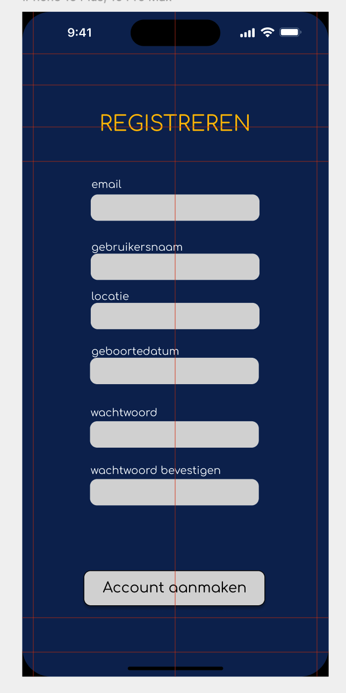
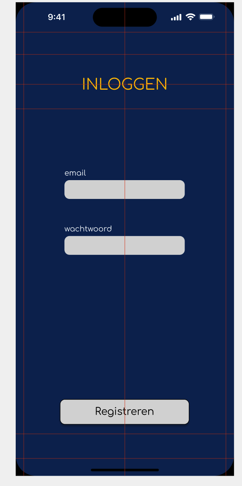
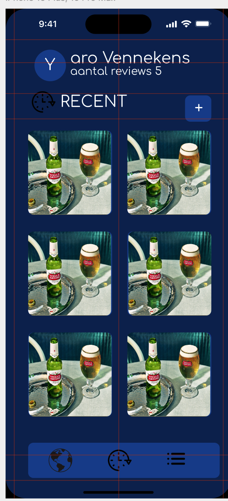
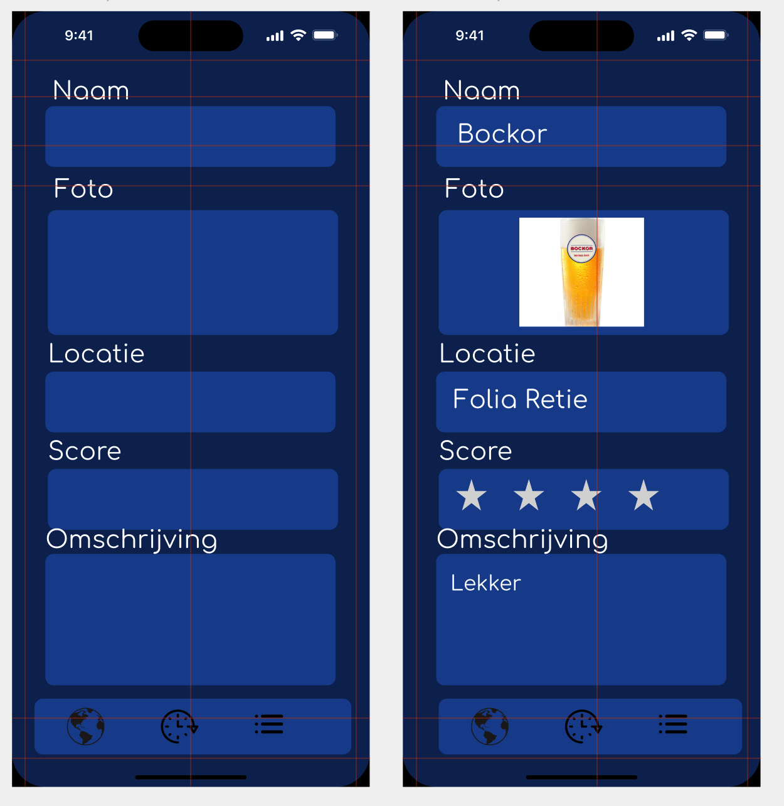
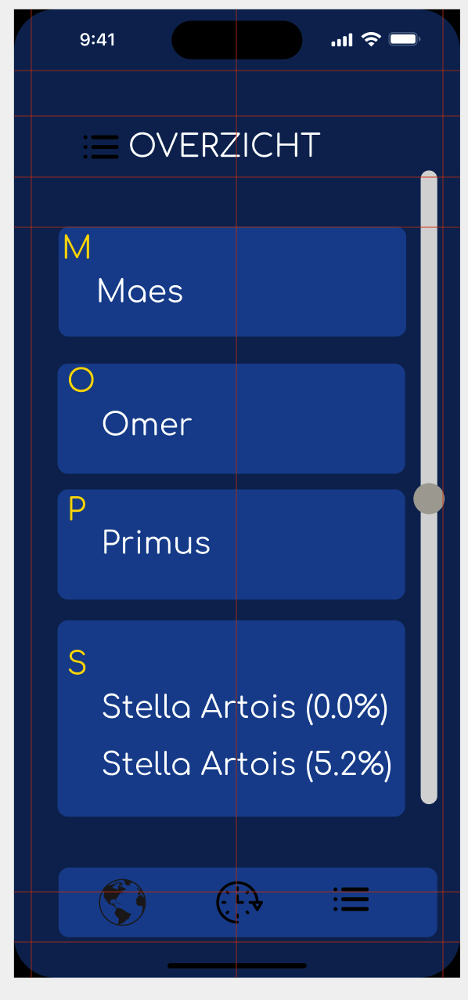
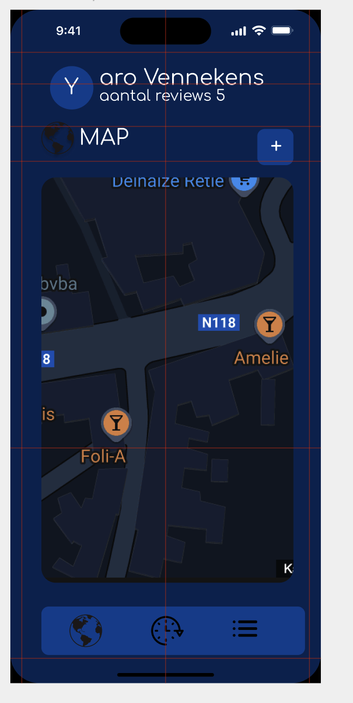

# Permanente evaluatie

**Vul hieronder verder aan zoals beschreven in de [projectopgave](https://javascript.pit-graduaten.be/evaluatie/mobile/pe.html).**

## Scherm 1

Bij dit scherm kan de gebruiker zijn informatie invullen voor het registeren van een account.
Met dit account kan de gebruiker vervolgens reviews maken.

## Scherm 2

Bij dit scherm moet de gebruiker inloggen met hun gegevens voor ze review kunnen aanmaken

## Scherm 3

Dit is het overzichtsscherm van de app zodra de gebruiker is ingelogd. 
Hier krijgt de gebruiker direct een duidelijk beeld van zijn activiteit. 
Bovenaan wordt weergegeven hoeveel reviews de gebruiker tot nu toe heeft geschreven, wat een leuke manier is om de voortgang bij te houden.
Onderaan  wordt een overzicht in een grid getoond van de zes meest recente reviews van de gebruiker deze worden uit de database gehaald.
Dit overzicht geeft snel toegang tot de nieuwste reviews, waarbij elke review kort wordt samengevat met bijvoorbeeld de naam van het bier,
de beoordeling en eventueel een foto.
## Scherm 4

_Beschrijving van de functionaliteiten in het eerste scherm van je app._

Dit scherm is gemaakt om het aanmaken van een review eenvoudig te maken. De gebruiker doorloopt een aantal stappen om zijn ervaring met een pintje te delen:
1.	Naam van het pintje: Bovenaan het scherm kan de gebruiker de naam van het pintje invullen. Dit is de eerste stap om het bier te identificeren waar de review over gaat.
2.	Foto uploaden: Met een handige knop kan de gebruiker een foto maken of uploaden via de camera van zijn gsm. Dit maakt de review persoonlijker.
3.	Locatie selecteren: Dankzij GPS-functionaliteit kan de gebruiker eenvoudig aangeven waar het pintje werd gedronken. Dit voegt een locatie  toe aan de review dit kan vervolgens gebruikt worden voor te zien op te kaart waar je vooral een pintje gedronken hebt.
4.	Beoordeling geven: Met een eenvoudige sterrenslider kan de gebruiker het bier een score geven van 1 tot 5 sterren. Dit maakt de beoordeling overzichtelijk en direct begrijpelijk voor anderen.
5.	Omschrijving toevoegen: Ten slotte kan de gebruiker een persoonlijke omschrijving toevoegen. Hier kan hij of zij bijvoorbeeld vertellen over de smaak, geur, presentatie of andere indrukken van het pintje.

Wanneer de gebruiker de review heeft aangemaakt wordt deze toegevoegd aan de database

## Scherm 5

Dit scherm biedt een overzicht van alle pintjes die je al hebt gedronken, 
in een handige en visueel aantrekkelijke scrollview. 
De pintjes worden automatisch alfabetisch gesorteerd, zodat je snel en eenvoudig specifieke bieren kunt terugvinden.

## Scherm 6

Dit scherm toont een interactieve kaart waarop de gebruiker kan zien waar hij overal een pintje heeft gedronken . Elke locatie waar een review is aangemaakt, wordt gemarkeerd met een duidelijke pin of icoon, wat een visueel overzicht geeft van de reviews van de gebruiker.

## Native modules

_Bespreek hier minstens twee native modules die je verwerkt in je applicatie.
Lees de [projectopgave](https://javascript.pit-graduaten.be/evaluatie/mobile/project.html#native-modules) voor meer info 
over wat een native module juist is._

Geolocatie -> Bij het aanmaken van een review wordt automatisch gebruikgemaakt van de GPS-locatie van de gsm.
Hierdoor wordt  vastgelegd waar je een pintje hebt gedronken.
Deze locatie wordt gekoppeld aan de review en later weergegeven op de  kaart.

Camera -> Bij het aanmaken van een review moet je een foto uploaden van het pintje dat je hebt gedronken.

## Online services

_Bespreek hier minstens één online service die je verwerkt in je applicatie.
Lees de [projectopgave](https://javascript.pit-graduaten.be/evaluatie/mobile/project.html#online-services) voor meer info
over wat een native module juist is._

Supabase -> Voor het opslagen van de reviews van de gebruiker.

## Gestures & animaties

_Bespreek hier waar je minstens één gesture en één animatie verwerkt in je applicatie._

Swipe -> Voor het verwijderen van een review.

# Feedback

Je schrijft dat je Supabase gaat gebruiken, alhoewel ik Supabase heel graag heb, gaat dit uitdagender
zijn dan Firebase. 
Gezien de hoge werkdruk (de drie projecten), zou ik je aanraden om toch Firebase te gebruiken. 

Je wilt afbeeldingen uploaden, hiervoor moet je een online service gebruiken (blob storage), zie het 
optionele, extra lesvoorbeeld (aankondiging volgt op Canvas).

Je wilt ook registreren toevoegen, hiervoor heb je opnieuw een extra online service nodig (firebase authentication),
je hebt ook sowieso een native module nodig om met firebase te werken.
Als je Google login toevoegt zelf nog een vierde.
Ik zou dit zeker doen aangezien het relatief eenvoudig is om te implementeren en je er wel wat punten
mee kunt verdienen.

20/20

